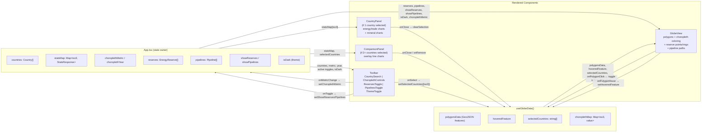

# Energy World

A web app with a 3D globe to explore energy, trade, and critical mineral statistics by country. Features include choropleth maps, time-series charts, energy reserve locations, pipeline routes, and multi-country comparisons.

Built with React, Vite, react-globe.gl, Fastify, SQLite (via better-sqlite3), and Drizzle ORM.

**Requirements:** Node.js 20+

## Setup

### 1. Install Node.js 20 via fnm

If you don't already have Node 20+, install [fnm](https://github.com/Schniz/fnm) (Fast Node Manager):

```powershell
winget install Schniz.fnm
```

Close and reopen your terminal, then run:

```powershell
fnm install 20
fnm use 20
fnm default 20
```

Add this line to your PowerShell profile so fnm activates automatically (`notepad $PROFILE`):

```powershell
fnm env --use-on-cd --shell power-shell | Out-String | Invoke-Expression
```

Verify:

```powershell
node --version   # You should see v20.x.x
```

### 2. Install dependencies

```powershell
cd energyworld
npm install
```

### 3. Create the database and seed it

No Docker or external database needed -- this uses SQLite (a local file).

```powershell
npm run db:migrate
npm run db:seed
```

### 4. Start the app

Open **two terminals** (both in the `energyworld` folder):

**Terminal 1 -- API server:**

```powershell
npm run dev:server
```

**Terminal 2 -- Frontend:**

```powershell
npm run dev:client
```

- API: http://localhost:3000
- App: http://localhost:5173 (proxies `/api` to the server automatically)

Open http://localhost:5173 in your browser, rotate the globe, and click a country.

## Scripts

| Command | Description |
|---------|-------------|
| `npm run dev:client` | Start Vite dev server (frontend) |
| `npm run dev:server` | Start Fastify dev server (API) |
| `npm run build:client` | Build frontend for production |
| `npm run build:server` | Build server for production |
| `npm run db:generate` | Generate Drizzle migrations from schema changes |
| `npm run db:migrate` | Run database migrations |
| `npm run db:seed` | Seed countries, stats, reserves, and pipelines |
| `npm run db:fetch` | Fetch latest stats from World Bank API and upsert into DB |

## Data

### Metrics

**Energy & Trade (2015-2022):**

- **Energy consumption** (TWh) -- Sources: IEA, BP Statistical Review, EIA
- **Exports / Imports** (billion USD) -- Source: World Bank Open Data

**Critical Minerals (2015-2022):**

- **Copper production** (kt) -- Source: USGS Mineral Commodity Summaries
- **Lithium production** (tonnes) -- Source: USGS
- **Cobalt production** (tonnes) -- Source: USGS, Cobalt Institute
- **Rare earth production** (tonnes REO) -- Source: USGS
- **Silicon production** (kt) -- Source: USGS
- **Nickel production** (kt) -- Source: USGS, International Nickel Study Group

### Reserves & Pipelines

- **Energy reserves**: 37 locations (oil, natural gas, coal, oil sands, shale) with lat/lng coordinates and estimated reserves. Source: public domain estimates from EIA, BP, OPEC.
- **Pipelines**: 30 major global pipelines (oil, gas, LNG, products) with geographic path coordinates, capacity, status, and length. Source: OpenStreetMap, ENTSOG, public pipeline operator data.

### How it gets ingested

1. **Seed data** lives in `server/src/db/seed-data.ts` (countries + 9 metric datasets), `reserves-data.ts`, and `pipelines-data.ts`.
2. **Seed script** (`npm run db:seed`) clears the SQLite DB and inserts all countries, stats, reserves, and pipelines. Only values explicitly present in the seed files are inserted -- no extrapolation.
3. The result is written to `server/data/energyworld.db`. The API reads from this file at runtime.

To change data, edit the relevant `*-data.ts` file then run `npm run db:seed`.

### Pull latest from APIs

Refresh the database with **latest data from the World Bank** (no API key required):

```powershell
npm run db:fetch
```

This fetches from the [World Bank API v2](https://datahelpdesk.worldbank.org/knowledgebase/articles/889392-about-the-indicators-api-documentation):
- **NE.EXP.GNFS.CD** -- Exports of goods and services (current US$)
- **NE.IMP.GNFS.CD** -- Imports of goods and services (current US$)
- **EG.USE.ELEC.KH** -- Electric power consumption (kWh, converted to TWh)

**Optional env:** `FETCH_YEAR_START` and `FETCH_YEAR_END` (default: 2015 through current year):

```powershell
$env:FETCH_YEAR_START="2020"; $env:FETCH_YEAR_END="2024"; npm run db:fetch
```

Run `npm run db:seed` first so the countries table is populated, then `npm run db:fetch` can refresh stats.

## Architecture

### High-level data flow

```mermaid
flowchart TB
    subgraph External["External Data Sources"]
        WB["World Bank API v2<br/>(exports, imports, electricity)"]
        USGS["USGS / IEA / BP<br/>(curated in seed files)"]
        OSM["OpenStreetMap / ENTSOG<br/>(pipeline coordinates)"]
        CDN["Natural Earth GeoJSON<br/>(country polygons via CDN)"]
    end

    subgraph Ingestion["Data Ingestion (offline scripts)"]
        SEED_DATA["seed-data.ts<br/>107 countries × 9 metrics<br/>(2015-2022)"]
        RESERVES_DATA["reserves-data.ts<br/>37 energy reserve locations"]
        PIPELINES_DATA["pipelines-data.ts<br/>30 pipeline routes"]
        SEED["seed.ts<br/>npm run db:seed"]
        FETCH["fetch-latest.ts<br/>npm run db:fetch"]
    end

    subgraph Database["SQLite Database (server/data/energyworld.db)"]
        COUNTRIES_TBL[("countries<br/>id, iso3, name")]
        STATS_TBL[("stats<br/>country_id, year,<br/>metric_type, value, unit")]
        RESERVES_TBL[("energy_reserves<br/>name, type, lat, lng,<br/>estimated_reserves")]
        PIPELINES_TBL[("pipelines<br/>name, type, status,<br/>capacity, path (JSON)")]
    end

    subgraph Server["Fastify API Server (:3000)"]
        INDEX_SVR["index.ts<br/>CORS + route registration"]
        R_COUNTRIES["/api/countries"]
        R_STATS["/api/stats<br/>/api/stats/choropleth"]
        R_RESERVES["/api/reserves"]
        R_PIPELINES["/api/pipelines"]
        CONNECTION["connection.ts<br/>+ Drizzle ORM"]
    end

    subgraph Client["React Frontend (:5173 via Vite)"]
        MAIN["main.tsx<br/>ErrorBoundary + StrictMode"]
        APP["App.tsx<br/>Global state orchestrator"]
        API_CLIENT["api/client.ts<br/>Types, constants,<br/>fetch functions"]

        subgraph Components["UI Components"]
            GLOBE["GlobeView<br/>3D globe, choropleth,<br/>reserves, pipelines"]
            GLOBE_HOOK["useGlobeData()<br/>polygon/selection state"]
            PANEL["CountryPanel<br/>time-series charts<br/>(9 metrics)"]
            COMPARISON["ComparisonPanel<br/>multi-country charts"]
            SEARCH["CountrySearch<br/>search combobox"]
            CHOROPLETH["ChoroplethControls<br/>metric + year selectors"]
            TOGGLES["ReservesToggle<br/>PipelinesToggle<br/>ThemeToggle"]
        end
    end

    %% Ingestion flows
    USGS --> SEED_DATA
    USGS --> RESERVES_DATA
    OSM --> PIPELINES_DATA
    SEED_DATA --> SEED
    RESERVES_DATA --> SEED
    PIPELINES_DATA --> SEED
    SEED --> COUNTRIES_TBL
    SEED --> STATS_TBL
    SEED --> RESERVES_TBL
    SEED --> PIPELINES_TBL
    WB --> FETCH
    FETCH --> STATS_TBL

    %% Server reads DB
    CONNECTION --> COUNTRIES_TBL
    CONNECTION --> STATS_TBL
    CONNECTION --> RESERVES_TBL
    CONNECTION --> PIPELINES_TBL
    INDEX_SVR --> R_COUNTRIES
    INDEX_SVR --> R_STATS
    INDEX_SVR --> R_RESERVES
    INDEX_SVR --> R_PIPELINES
    R_COUNTRIES --> CONNECTION
    R_STATS --> CONNECTION
    R_RESERVES --> CONNECTION
    R_PIPELINES --> CONNECTION

    %% Client fetches from API
    API_CLIENT -->|"fetch /api/*<br/>(Vite proxy)"| INDEX_SVR
    CDN -->|"GeoJSON fetch"| GLOBE

    %% Client component tree
    MAIN --> APP
    APP --> GLOBE
    APP --> GLOBE_HOOK
    APP --> PANEL
    APP --> COMPARISON
    APP --> SEARCH
    APP --> CHOROPLETH
    APP --> TOGGLES
    GLOBE_HOOK --> GLOBE
    API_CLIENT --> APP
```



### Component interaction detail



### Directory structure

```
energyworld/
├── client/                          React + Vite frontend
│   ├── src/
│   │   ├── api/
│   │   │   └── client.ts           Types, constants, API fetchers (single source of truth)
│   │   ├── components/
│   │   │   ├── Globe.tsx            3D globe + useGlobeData hook
│   │   │   ├── CountryPanel.tsx     Single-country stats with recharts
│   │   │   ├── ComparisonPanel.tsx  Multi-country comparison charts
│   │   │   ├── CountrySearch.tsx    Search combobox
│   │   │   ├── ChoroplethControls.tsx  Metric/year dropdown
│   │   │   ├── ReservesToggle.tsx   Reserve overlay toggle + legend
│   │   │   ├── PipelinesToggle.tsx  Pipeline overlay toggle + legend
│   │   │   ├── ThemeToggle.tsx      Dark/light theme switch
│   │   │   └── ErrorBoundary.tsx    React error boundary
│   │   ├── App.tsx                  Main shell, state orchestration
│   │   ├── main.tsx                 Entry point
│   │   └── index.css                Global styles + Tailwind
│   ├── vite.config.ts               Dev server + /api proxy to :3000
│   └── tailwind.config.js           darkMode: "class"
├── server/                          Fastify + SQLite backend
│   ├── src/
│   │   ├── db/
│   │   │   ├── connection.ts        SQLite connection factory (shared)
│   │   │   ├── schema.ts            Drizzle table definitions (4 tables)
│   │   │   ├── index.ts             Drizzle instance + re-exports
│   │   │   ├── migrate.ts           Run SQL migrations
│   │   │   ├── seed.ts              Seed script (countries, stats, reserves, pipelines)
│   │   │   ├── seed-data.ts         Country list + 9 metric datasets
│   │   │   ├── reserves-data.ts     37 energy reserve locations
│   │   │   ├── pipelines-data.ts    30 pipeline routes with coordinates
│   │   │   └── fetch-latest.ts      World Bank API data fetcher
│   │   ├── routes/
│   │   │   ├── countries.ts         GET /api/countries
│   │   │   ├── stats.ts             GET /api/stats, GET /api/stats/choropleth
│   │   │   ├── reserves.ts          GET /api/reserves
│   │   │   └── pipelines.ts         GET /api/pipelines
│   │   └── index.ts                 Fastify entry (CORS, route registration)
│   ├── drizzle/                     SQL migration files
│   ├── drizzle.config.ts            Drizzle Kit configuration
│   └── data/                        SQLite DB file (gitignored)
├── package.json                     npm workspaces root
└── README.md
```
